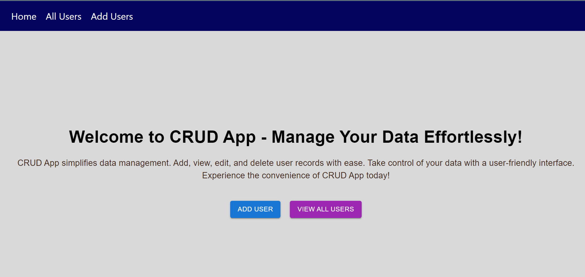

# CRUD-APP
This project is a simple CRUD (Create, Read, Update, Delete) application built with ReactJS and Material-UI. The application allows users to perform basic CRUD operations on a list of users, including adding new users, viewing all users, editing existing users, and deleting users.



A simple CRUD (Create, Read, Update, Delete) app built with React, Material-UI, Axios, and JSON Server.

## Getting Started

To get a copy of the project up and running on your local machine, follow the instructions below.

### Prerequisites

Make sure you have the following tools installed on your system:

- Node.js and npm: [https://nodejs.org/](https://nodejs.org/)
- Git: [https://git-scm.com/](https://git-scm.com/)

### Installation

1. Clone the repository:

```bash
git clone https://github.com/your-username/crud-app.git
cd crud-app
```

2. Install dependencies:

```bash
npm install
```

3. Start the development server:

```bash
npm start
```

The app will be running at [http://localhost:3000](http://localhost:3000).

## Usage

The CRUD app allows you to perform the following operations:

- Create: Add new data using the provided form.
- Read: View the existing data in a user-friendly interface.
- Update: Edit the existing data with real-time updates.
- Delete: Remove data with confirmation prompts.

## Technologies Used

The project uses the following technologies and libraries:

- React
- Material-UI
- Axios
- JSON Server
- 
## Features

The key features of the CRUD app include:

- Add new data with form validation
- Edit existing data with real-time updates
- Delete data with confirmation prompts
- View and filter data in a user-friendly interface

Feel free to explore My project and its functionalities.
- Thanks for visiting this😊
- 
## Contributing
Contributions to this project are welcome. If you have any suggestions, improvements, or bug fixes, please open an issue or submit a pull request. Your contributions will be greatly appreciated


